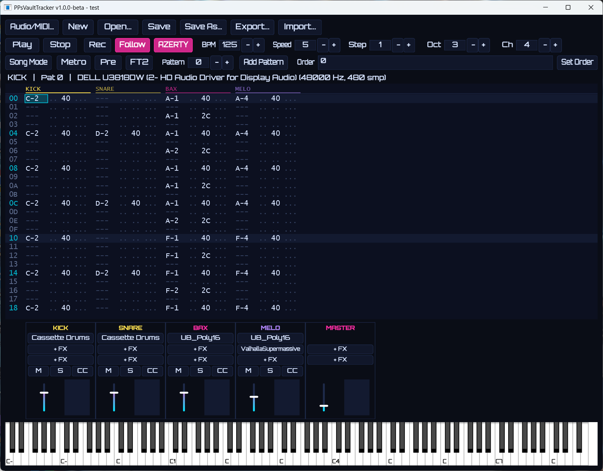

# PPsVaultTracker

**A modern VSTi tracker — by The Unborn / [RetroVault](https://retrovault.be)**

A pattern-based tracker in the FastTracker 2 / ProTracker lineage, hosting
**VST3 instruments and effects**, designed to compose full songs whose
deliverables (**MIDI + WAV stems**) import cleanly into Ableton Live for final
arrangement and mastering.

Windows + Linux (Ubuntu 24.04 reference). Built with [JUCE 8](https://juce.com)
(fetched at configure time, pinned). License: **AGPLv3**.



## Features

- **VST3 hosting** — one instrument per track (up to 16), insert FX chains
  per channel plus a master bus
- **FT2-style pattern editor** — hex rows, keyboard navigation, transpose,
  interpolation, block copy/paste, unlimited undo/redo; AZERTY/QWERTY and
  FT2/ProTracker keymap presets
- **Sample-accurate sequencer** — BPM + speed (ticks/row) clock, swing,
  song mode with order list
- **Live MIDI recording** — from the virtual keyboard or a hardware MIDI
  controller, quantized to the nearest row, with metronome and pre-count
- **Effect column = native MIDI** — `Axx`–`Hxx` send the CC mapped to that
  per-track slot (defaults: cutoff, resonance, mod wheel, volume, pan,
  reverb, chorus, sustain — editable from the mixer's CC button), `Pxx`
  pitch bend, `Nxx` note delay and `Kxx` note cut in ticks. No internal DSP:
  automation is portable, it exports as plain CC in the `.mid`
- **Mixer** — faders, mute/solo, VU meters per channel and master
- **Projects** — human-readable `.ubt` folder format (JSON + plugin
  states) with rotating autosave backups
- **Export for the studio** — multitrack MIDI (SMF type 1), per-channel
  WAV stems, master WAV/MP3 (LAME), and a tracklist of every plugin used —
  everything imports cleanly into Ableton Live
- **Module import** — MOD/XM/S3M/IT note data via libopenmpt (level 1:
  notes, no samples)
- **RetroVault synthwave theme** — Orbitron, cyan/magenta on deep blue

> ✨ **Status: v1.0.0-beta.** The engine and workflow are feature-complete.
> On the roadmap for later releases: a bundled demo song, the OUTRUN/LATENT
> visualizers from the RetroVault MOD player, and UI refinements.

## Download

Grab the portable Windows build from the
[latest release](https://github.com/gPTPPs/ppsvaulttracker/releases) —
unzip and run, nothing to install. MP3 export needs a `lame.exe`
(e.g. `winget install LAME.LAME`); the app asks for its location once.

## Building

Requirements: CMake 3.22+, a C++20 toolchain (MSVC 2022 / GCC 13+), and on
Linux the usual JUCE dev packages (see `.github/workflows/ci.yml`).

```bash
cmake -S . -B build -DCMAKE_BUILD_TYPE=Release
cmake --build build --config Release --parallel
ctest --test-dir build -C Release
```

JUCE 8.0.14 is downloaded automatically by CMake FetchContent on first
configure — nothing to install manually.

⚠️ Plugins load **in-process** with no sandbox (documented v1 trade-off,
like Renoise). A misbehaving plugin can take the app down — only load
plugins you trust. Autosave has your back.

## License

**GNU AGPLv3** — see [LICENSE](LICENSE) and
[THIRD_PARTY_LICENSES.md](THIRD_PARTY_LICENSES.md).
VST® is a registered trademark of Steinberg Media Technologies GmbH.
